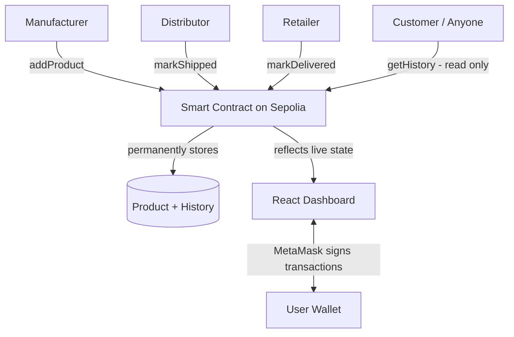

# Blockchain-Based Supply Chain Tracker (Role-Based)

A decentralized application (DApp) that tracks a product's journey through a supply chain — from manufacturing to final delivery — on the Ethereum blockchain. Access is role-based: only the correct party in the chain can perform each step, and every action is permanently recorded and publicly verifiable.

## Problem it solves

Traditional supply chain systems rely on centralized databases controlled by individual companies, where records can be edited, hidden, or disputed. There is also usually no clear, enforced separation of who is allowed to do what at each stage.

This project solves both problems using a smart contract:
- **Immutability** — once a status is recorded, it can never be changed or deleted.
- **Transparency** — anyone can look up a product's full history.
- **Role-based access control** — the contract enforces who can do what:
  - Only a **Manufacturer** can register a new product
  - Only a **Distributor** can mark it as shipped
  - Only a **Retailer** can mark it as delivered
  - Only the **Admin** (contract deployer) can assign these roles to wallet addresses

This mirrors how a real supply chain works — each party has a distinct responsibility, and the code enforces that boundary instead of relying on trust.

## Architecture



Every write action (registering, shipping, delivering) goes through MetaMask for a signature, gets recorded permanently on-chain, and is immediately reflected back in the dashboard. Read actions (viewing history) are free and need no signature — anyone, including customers with no assigned role, can look up a product's full journey.

## Tech stack

| Layer | Technology |
|---|---|
| Smart contract | Solidity ^0.8.0 |
| Blockchain network | Ethereum (Sepolia testnet) |
| Development environment | Remix IDE |
| Wallet / signing | MetaMask |
| Frontend | React (via CDN), ethers.js |
| Hosting | GitHub Pages |

## Roles

| Role | Can do |
|---|---|
| Admin | Assign roles to wallet addresses |
| Manufacturer | Register new products |
| Distributor | Mark a product as "Shipped" |
| Retailer | Mark a product as "Delivered" |
| Customer (anyone, no role needed) | View any product's history, scan a QR code to look one up |

## Smart contract functions

| Function | Description | Who can call it |
|---|---|---|
| `assignRole(address, role)` | Assigns a role to a wallet address | Admin only |
| `addProduct(id, name)` | Registers a new product with status "Manufactured" | Manufacturer only |
| `markShipped(id)` | Updates status to "Shipped" | Distributor only |
| `markDelivered(id)` | Updates status to "Delivered" | Retailer only |
| `getHistory(id)` | Returns the full timestamped history of a product | Anyone (read-only, free) |
| `getProduct(id)` | Returns a product's current state | Anyone (read-only, free) |
| `getAllProductIds()` | Returns every registered product ID | Anyone (read-only, free) |
| `getMyRole()` | Returns the caller's own assigned role | Anyone (read-only, free) |

The contract also emits `RoleAssigned`, `ProductAdded`, and `StatusUpdated` events so external tools could listen for changes in real time instead of repeatedly polling the blockchain.

## Project structure

```
supply-chain-tracker/
├── README.md
├── SupplyChain.sol      # Role-based smart contract
├── index.html           # Page shell, links style.css and app.js
├── style.css            # All styling
└── app.js               # React app logic (components, contract calls)
```

## How to run this project

### 1. Deploy the smart contract
1. Open [Remix IDE](https://remix.ethereum.org).
2. Paste in `SupplyChain.sol` and compile it.
3. Under **Deploy & Run Transactions**, connect MetaMask (Environment: Injected Provider / Browser Extension), set to the **Sepolia test network**, and deploy.
4. The account that deploys becomes the **Admin**.

### 2. Assign roles
As Admin, call `assignRole(walletAddress, roleNumber)` for each participant:
- `1` = Manufacturer
- `2` = Distributor
- `3` = Retailer

You can assign your own wallet a role too, so you can test every step yourself using one account, or use different MetaMask accounts to simulate different real participants.

### 3. Run the frontend
1. Make sure `index.html`, `style.css`, and `app.js` are all in the same folder (or same GitHub repo root) — `index.html` loads the other two.
2. Open `index.html` in a browser, or visit the live GitHub Pages link (see below).
3. Click **Connect Wallet**.
4. Paste in the deployed contract address.
5. Use the **Dashboard** tab to see all products (search by ID/name, generate a QR code, or jump to history), **My Actions** to register/update products (based on your role), **Admin** to assign roles, and **Lookup History** to trace any product's full journey.

## Example flow

```
Admin assigns:
  0xAAA... → Manufacturer
  0xBBB... → Distributor
  0xCCC... → Retailer

As Manufacturer (0xAAA):
  addProduct(1, "Wireless Mouse")
  → status: Manufactured

As Distributor (0xBBB):
  markShipped(1)
  → status: Shipped

As Retailer (0xCCC):
  markDelivered(1)
  → status: Delivered

getHistory(1) →
  [
    { status: "Manufactured", updatedBy: 0xAAA..., timestamp: ... },
    { status: "Shipped",      updatedBy: 0xBBB..., timestamp: ... },
    { status: "Delivered",    updatedBy: 0xCCC..., timestamp: ... }
  ]
```

## Features

- Role-based access control (Manufacturer, Distributor, Retailer, Admin)
- Full timestamped history per product
- QR code generation for any product, so a customer could scan it at a physical checkpoint and jump straight to its history
- Search products by ID or name on the dashboard
- Etherscan-verified source code

## Screenshots

*(Add 2-3 screenshots here: the Dashboard tab, the Lookup History timeline, and a MetaMask confirmation popup mid-transaction. This helps anyone browsing the repo understand the project without running it themselves.)*

## Why this design

A single-owner system (where one wallet can do everything) is easy to build but doesn't reflect how supply chains actually work — different companies handle different stages, and none of them should be able to perform another's role. Enforcing this with `onlyRole` modifiers means the rules live in the contract itself, not in a policy document that could be ignored.

## Possible future improvements

- Multiple manufacturers/distributors/retailers competing or collaborating on the same product
- QR code generation per product ID for lookup at physical checkpoints
- Time-based alerts if a product stays "Shipped" too long without being delivered
- A public verification page for end customers to check authenticity before purchase

## Live deployment

- **Live app:** https://suchismita52.github.io/supply-chain-tracker/index.html
- **Deployed contract (Sepolia):** `0x7a47A253e566Df381Ae4f563AD5283c97DE757e2`
- **View on Sepolia Etherscan (source code verified ✅):** https://sepolia.etherscan.io/address/0x7a47A253e566Df381Ae4f563AD5283c97DE757e2#code

The contract's source code is verified on Etherscan, meaning anyone can view the exact Solidity code that was deployed and confirm it matches what's in this repository — no need to trust a screenshot or take my word for it.

## Author

Built as a final-year blockchain project demonstrating smart contract development, role-based access control, and full-stack DApp architecture.


